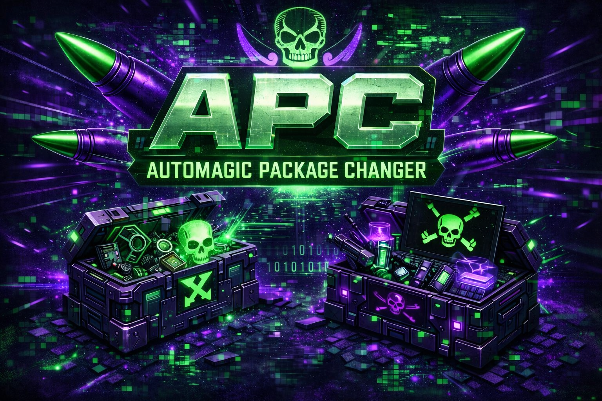

<p align="center">
  
</p>

<h1 align="center">AUTOMAGIC PACKAGE CHANGER</h1>

<p align="center">
  <strong>Rename Quest game packages with one drop. No fuss. No command lines. Just magic.</strong>
</p>

<p align="center">
  <a href="#features">Features</a> &bull;
  <a href="#how-to-use">How to Use</a> &bull;
  <a href="#download">Download</a> &bull;
  <a href="#faq">FAQ</a>
</p>

---

## What is APC?

**Automagic Package Changer (APC)** is a desktop app that renames Android APK package names for Meta Quest games. Drop your APK, pick a rename mode, and APC handles the rest - decompiling, renaming, rebuilding, re-signing, and even renaming matching OBB folders.

Think of it as your **Phunk** / **APKognito** alternative with a cyber-pirate edge.

---

## Features

- **Drag & Drop** - Just drop your `.apk` file onto the app. Done.
- **Default Mode (.apc)** - One-click rename that inserts `.apc` into the package name (e.g. `com.game.title` becomes `com.apc.game.title`)
- **MR Fix Mode (.mr)** - For MR fixes - inserts `.mr` (e.g. `com.game.title` becomes `com.mr.game.title`)
- **Custom Tag** - Pick your own 2-3 letter tag (DMP, QG, whatever you want) that gets inserted the same way
- **Auto OBB Handling** - Detects OBB/data folders sitting next to your APK and renames them to match
- **Auto Re-Sign** - Every renamed APK is automatically re-signed so it installs cleanly
- **Self-Contained** - Bundles its own Java runtime, apktool, and signer. No dependencies to install.
- **Neon Cyber-Pirate UI** - Because renaming packages should look as cool as it feels

---

## How to Use

### 1. Drop Your APK

Launch APC and drag your `.apk` file onto the drop zone (or click to browse).

### 2. Choose Your Mode

| Mode | What it does | Example |
|------|-------------|---------|
| **DEFAULT (.apc)** | Inserts `.apc` after the first segment | `com.studio.game` → `com.apc.studio.game` |
| **MR FIX (.mr)** | Inserts `.mr` for MR fix packages | `com.studio.game` → `com.mr.studio.game` |
| **CUSTOM TAG** | You choose a 2-3 letter tag | `com.studio.game` → `com.dmp.studio.game` |

### 3. Hit Rename & Sign

APC will:
1. Decompile the APK
2. Rename the package everywhere it matters
3. Rebuild the APK
4. Re-sign it with a debug key
5. Check for and rename any nearby OBB folder

Your renamed APK appears in the same folder as the original, with `_renamed` appended.

### 4. OBB Auto-Detection

If your APK sits next to a folder named after the original package (the OBB/data folder), APC finds it and renames it to match. No extra steps needed.

```
MyGame/
├── game.apk
└── com.studio.game/          ← APC finds this
    └── main.1.com.studio.game.obb  ← renames this too
```

After rename (default mode):
```
MyGame/
├── game_renamed.apk
└── com.apc.studio.game/
    └── main.1.com.apc.studio.game.obb
```

---

## Download

Grab the latest release from the [Releases](../../releases) page:

- **Portable** (`AutomagicPackageChanger-Portable.exe`) - Single file, no install needed. Just run it.
- **Installer** (`AutomagicPackageChanger-Setup.exe`) - Traditional installer with Start Menu shortcut.

---

## FAQ

**Q: Does this work with all Quest games?**
A: It works with standard APKs. Some games with heavy native code or unusual build configurations may have issues - try it and see.

**Q: Will the renamed game work online / with multiplayer?**
A: Package renaming changes the app's identity on the device. Online features that validate against the package name may not work.

**Q: My antivirus flagged it!**
A: This is a known false positive with Electron apps and APK signing tools. The app is open source - inspect the code yourself.

**Q: Do I need Java installed?**
A: No. APC bundles its own portable Java runtime. Nothing else to install.

**Q: The rename is taking forever!**
A: Large Quest games (1-4GB) take time to decompile and rebuild. The progress bar keeps you updated. Be patient - it's working.

**Q: Can I rename an already-renamed APK again?**
A: Yes, but APC will warn you if the tag is already in the package name.

---

## License

MIT

---

<p align="center">
  <em>// SAIL THE DIGITAL SEAS //</em>
</p>
